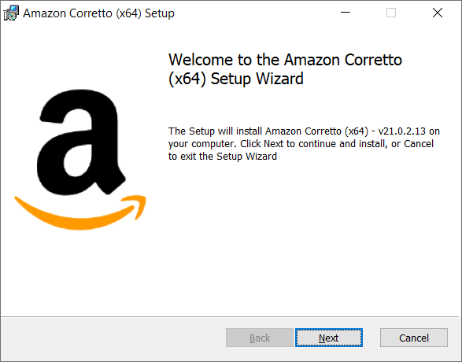
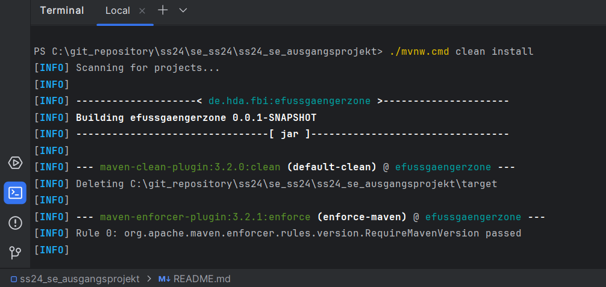

Aufbau eFußgängerzone
============================

*Hinweis für Studenten:* Teile dieser Dokumentation ergeben sich erst durch Wissen der späteren
Vorlesungsveranstaltungen. Fortgeschrittene Themen aus dem Teil Software Architektur werden in der Vorlesung nur am
Rande behandelt. Lassen Sie sich nicht entmutigen, wenn Sie dieser Dokumentation nicht beim ersten Lesen folgen können.

Dieses Dokument beschreibt den Aufbau des Software Projekts _eFusgängerzone_.
Es dient dem Zweck eines tieferen Verständnisses des Aufbaus des Projekts und ist gleichzeitig eine Richtschnur für die
Erweiterung des Projekts.

## Überblick über die Dateien und Ordner

Das Projekt hat grob skizziert folgenden Datei Aufbau:

```
.
├── .idea
├── mvnw / mvnw.cmd
├── pom.xml
├── src
│   ├── main
│   │   ├── java
│   │   │   └── de
│   │   │       └── hda
│   │   │           └── fbi
│   │   │               └── efussgaengerzone
│   │   │                   ├── EfussgaengerzoneApplication.java
│   │   │                   ├── adapter
│   │   │                   ├── domain
│   │   │                   │   ├── model
│   │   │                   │   └── usecase
│   │   │                   └── views
│   │   │                       └── dto
│   │   └── resources
│   │       ├── static
│   │       │   ├── css
│   │       │   └── images 
│   │       ├── templates
│   │       └── application.yml
│   └── test
│       └── java
│           └── de
│               └── hda
│                   └── fbi
│                       └── efussgaengerzone
└── target
```

Die einzelnen Dateien und Ordner haben hierbei folgende Aufgaben:

1. `.idea`: Hier speichert vornehmlich IntelliJ seine Projektdateien. Eine Anpassung dieses Ordners ist nicht notwendig.
   Das Ausgangsprojekt liefert
   drei [runConfigurations](https://www.jetbrains.com/help/idea/run-debug-configuration.html) zur sofortigen Benutzung,
   um den Einstieg zu erleichtern.
1. `mvnw / mvnw.cmd`: Sind jeweils Wrapper für Skripte für Unixoide Betriebssysteme (`mvnw:` MacOs, Linux) und
   Windows (`mvnw.cmd`) um Maven ohne Installation auf der Konsole ausführen zu können. Ein weiterer Vorteil ist, dass
   das Projekt hiermit seine genaue Maven Version mitliefert.
1. `pom.xml`: Dies ist die Konfiguration für das Build Tool Apache Maven. Es enthält Informationen über die verwendeten
   Libraries und gibt an wie das Projekt kompiliert und paketiert werden soll. Zusätzliche Libraries sind hier
   einzutragen.
1. `src`: Bei Maven ist aller Quellcode per Konvention immer unter diesem Ordner zu finden.
1. `main`: Hier wird Programmcode, genauer Java Dateien, abgelegt.
1. `java/de/hda/fbi/efussgaengerzone`: Dies ist der Paketpräfix des Projekts. Er wird in Java Programmen mit der selben
   Ordnerstruktur auf dem Dateisystem abgebildet.
1. `EfussgaengerzoneApplication.java`: Diese Datei enthält den Einstiegspunkt in das Java Programm.
1. `adapter/domain/views`: Dies sind weitere Unterpakete die im zweiten Teil dieser Dokumentation erklärt werden.
1. `resources`: Hier werden zusätzliche Dateien abgelegt die im Code verwendet werden sollen abgelegt. Sie werden beim
   Paketieren in die resultierende Programmdatei eingebettet. Hinweis: Java Programme werden meist als `.jar`-Datei
   ausgeliefert. `.jar`-Dateien sind ZIP-Dateien aus Kompiliertem Java (`.class`) und anderen Dateien.
1. `static`: Hier werden CSS und Bilddateien für die Verwendung im HTML-Frontend abgelegt.
1. `templates`: Hier werden die HTML Templates abgelegt, welche das Frontend der Applikation bilden. Die Templates
   werden dynamisch von der Applikation gerendert, wenn ein Nutzer das Frontend aufruft.
1. `application.yaml`: Diese Datei dient der Konfiguration der Applikation und
1. `test`: In diesem Teil wird Testcode abgelegt. Bei korrekter Konfiguration werden diese Testfälle automatisch durch
   Maven in der Test-Phase ausgeführt. Die Dateistruktur folgt hier den Paketen des Quellcodes.
1. `target`: Enthält den kompilierten Programmcode und nach der Ausführung der _Package_ Phase von Maven auch das
   Paketierte Programm als `.jar`.

## Paketstruktur und Software Architektur

Das Projekt folgt im Kern
einer [Hexagonalen Architektur](https://en.wikipedia.org/wiki/Hexagonal_architecture_(software)).
Die Pakete sind folgendermaßen geschnitten:

1. `domain`: Dieses Paket enthält nur Fachliche Komponenten und Code. Sämtliche technischen Aspekte sind hier über
   Interfaces abstrahiert. Abhängigkeiten zu technischen Frameworks und Libraries sollten hier vermieden werden.
   1. `model`: Enthält nur Entitäten und Wertobjekte der Problemdomäne, wieder ohne technische Details. Klassen in
      diesem Paket sollten von keinem anderen Paket abhängig sein.
   1. `usecase`: Enthält die fachlichen Anwendungsfälle. Dies ist die Kerngeschäftslogik, die benötigt wird um die
      Interaktionen des Nutzers abzubilden. Klassen aus diesem Paket sollten nur Klassen aus dem eigenen und dem
      Paket `model` verwenden.
1. `adapter`: Enthält allgemeine Implementierungen zu den Abstraktionen (Interfaces oder abstrakte Klassen) aus
   dem `domain` Paket. Mehrere Implementierungen für die gleichen Abstraktionen sind denkbar um verschiedene technische
   Umgebungen oder Konfigurationen abzubilden. Abhängigkeiten zu Frameworks und Library's gehören hier hinenin.
1. `views`: Enthält gesammelt Implementierungen rund um UI (Modelle, Logik und Markup), siehe
   auch [MVC](https://de.wikipedia.org/wiki/Model_View_Controller). Das Frontend ist eine statische Web-Applikation, die
   beim Aufruf der `*Controller.java`-Klassen serverseitig mit Daten befüllt wird. Dazu werden die
   HTML [Mustache Templates](https://mustache.github.io/) aus dem `/src/resources/templates`-Ordner mit Daten aus dem
   Modell (`views/dto`) gerendert und an den Client ausgeliefert.

Im Kontext von einer Hexagonalen Architektur entspricht das Paket `domain` dem _Application Core_, die Pakete `adapter`
und `view` sind beide _Adapter_ Pakete. Diese Trennung ermöglicht beispielsweise den Austausch der Persistenzschicht
durch eine vollwertige Datenbank oder den Austausch des UI Frameworks ohne die fachliche Logik oder Datenmodelle ändern
zu müssen.

*Hinweis für Studenten:* Eine kurze und daher _sehr_ fortgeschrittene Einführung in das Thema Hexagonale Architekturen
mit Vorteilen und Parallelen zu anderen Modellen finden
Sie [hier](https://www.maibornwolff.de/blog/von-schichten-zu-ringen-hexagonale-architekturen-erklaert). Eine etwas
ausführlicher Erklärung finden Sie als Video [hier](https://www.jug-da.de/2020/06/Hexagonale-Architektur/).

## Ausführung

Zuerst müssen Sie ein JDK 21 installieren. Öffnen Sie im Browser "https://docs.aws.amazon.com/corretto/latest/corretto-21-ug/downloads-list.html"
und laden Sie sich die passende JDK-Version herunter (z. B. für MS Windows x64 https://corretto.aws/downloads/latest/amazon-corretto-21-x64-windows-jdk.msi).
Anschließend installieren Sie das JDK.

{width=40}
{width=20}


Bevor die Anwendung gestartet werden kann, sollte das Terminal geöffnet und einmal der Befehl `./mvnw.cmd clean install`
(bzw. `./mvnw clean install` auf UNIX-Systemen) ausgeführt werden.




Die Anwendung kann durch die mitgelieferte run-debug-Config direkt über die `Run`-Schaltfläche ("grüner Pfeil") in der IDE gestartet werden.


Falls die Run-Config nicht standardmäßig geladen sein sollte, kann eine neue Run-Config erstellt werden.
Hierzu sind die folgenden Schritte in IntelliJ auszuführen:

1. Run/Debug Configurations -> `Edit Configurations...` auswählen
2. Unter `Spring Boot` eine neue Run-Config anlegen -> `Add new run configuration...`
3. Als SDK wird `java 21` ausgewählt und als `Main Class` wird `de.hda.fbi.efussgaengerzone.EfussgaengerzoneApplication` festgelegt.
4. Bei `Active Profiles` wird `debug` angegeben. Dies sorgt dafür, dass die Applikation mit Beispieldaten befüllt wird.
5. Anschließend wird das Fenster mit `OK` geschlossen. 
6. Die run-config auswählen und über die `Run`-Schaltfläche ("grüner Pfeil") die Sprint-Anwendung starten.

Nach dem Start der Applikation ist das Frontend unter `http://localhost:8080` erreichbar. Wird die Applikation wie oben
beschrieben im `debug` Profil gestartet, ist anschließend ein Login im Shop mit folgenden Zugangsdaten möglich:

Alternative 1 (Shop mit Termindaten):
Username: `owner@cofee.shop`, Password: `123`

Alternative 2 (Shop ohne Termindaten):
Username: `owner@cigar.shop`, Password: `123`
